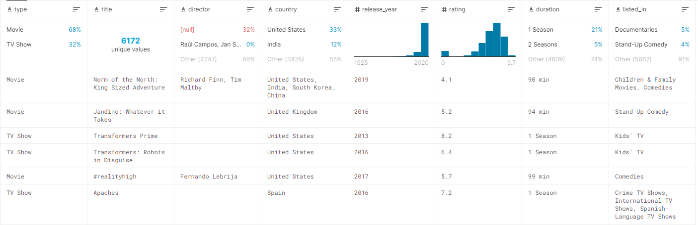

```{r library, echo = FALSE, message= FALSE,warning=FALSE}
  #Librerie 
  library(tidyverse)
  library(dplyr)
  library(modelr)
  library(stringr)
  library(ggplot2)
  library(plotly)
  library(gganimate)
  library(readxl)
  library(shiny)
  library(readr)
```
## <span style="color:steelblue">CASO DI STUDIO:</span>
- NETFLIX data with IMDB scores added

*link del dataset* [link](https://www.kaggle.com/sarahjeeeze/imdbfile)

<span style="color:steelblue">COSA CONTIENE:</span> 


## <span style="color:steelblue">Perchè ho scelto proprio questo dataset?</span>

<p>Ho scelto questo caso di studi per "immergermi" nel mondo del cinema, specialmente per scoprire nuovi film e serie Tv che non ho mai preso in considerazione.</p>

## <span style="color:steelblue">Domande che mi sono posto</span>
*  Il rating dei film/Tv Show è "influenzato" dalla durata di quest'ultimo? ESEMPIO: Movie e TV Show
*  I film vecchi sono più quotati rispetto a quelli nuovi?
*  Su netflix quale "genere" è più seguito? ESEMPIO: Movie vs TV Show 
*  Che genere di film viene più apprezzato? 
*  Che genere di TV Show viene più apprezzato?
*  Lo Stato in cui è stato registrato il film/serie influenza sull'assegnazione del rating?


## <span style="color:steelblue">Prima di tutto</span>

<p>Prima di iniziare uno studio approfondito ho deciso di prendere confidenza con i dati appena ottenuti e quindi, dopo una attenta analisi dei dati grezzi e del loro tipo, ho deciso di sfruttarre le due categorie già presenti nel dataset:</p>
* Movie
* TV Show

<p>Di seguito ho inziato a rispondere alle domande che mi sono posto in precendenza</p>
 
## <span style="color:steelblue">**Rating x Lunghezza**</span>
 *Movie vs TV Show*
```{r, echo = FALSE, message= FALSE,warning=FALSE}
netflix <- read_csv("netflixRating.csv")

Tv_Show <-
  netflix%>%
  filter(type == "TV Show")%>%
  group_by(duration)%>%
  summarise(median_rating = median(rating))

Tv_Show<-
separate(Tv_Show,duration,into = c("Season","Descrizione"),sep=" ")

Tv_Show$Descrizione <- NULL

Tv_Show <-
transform(Tv_Show,Season = as.numeric(Season)) 

ShowOrdinati <-
Tv_Show%>%
  arrange(Season)%>%
  select(Season,median_rating)

ggplot(ShowOrdinati,aes(Season,median_rating)) + 
  geom_line(size=0.5)+
  theme_linedraw()+
  labs(
    title="Caso TV SHOW"
  )+
  xlab("Season")+
  ylab("Rating")


```

## <span style="color:steelblue">**Rating x Lunghezza**</span>
 *Movie vs TV Show*
```{r, echo = FALSE, message= FALSE,warning=FALSE}
Movie <-
netflix%>%
    filter(type == "Movie")%>%
    group_by(duration)%>%
    summarise(median_rating = median(rating))

Movie <-
  separate(Movie,duration, into = c("Durata","Descrizione"),sep=" ")
Movie$Descrizione <- NULL

Movie <-
transform(Movie,Durata = as.numeric(Durata)) 

MovieOrdinati <-
 Movie%>%
  arrange(Durata)%>%
  select(Durata,median_rating)

ggplot(MovieOrdinati,aes(Durata,median_rating)) + 
  geom_line(size=0.30)+
  theme_bw()+
  labs(
    title = "Caso Movie"
  )+
  xlab("Durata")+
  ylab("Rating")

```

## <span style="color:steelblue">**Rating x Age**</span> 

```{r, echo = FALSE, message= FALSE,warning=FALSE}
MovieXDataRilascio<-
netflix%>%
  filter(type=="Movie")%>%
  group_by(release_year)%>%
    summarise(median_rating = median(rating))
mod1 = lm(median_rating ~ release_year,data=MovieXDataRilascio)
#prendiamo i dati in maniera equispaziato, griglia con valori x= release_year
grid <- data_grid(MovieXDataRilascio,release_year)

# add values predicted by the model over the grid
grid <- add_predictions(grid, mod1)

ggplot(MovieXDataRilascio, aes(x = release_year)) +
  geom_point(aes(y = median_rating)) + # observed values
  geom_line(data = grid, mapping = aes(y = pred), colour = "red")+ # predicted values
  theme_minimal()+
  xlab("Anno")+
  ylab("Rating")

```

## <span style="color:steelblue">**Miglior genere**</span>

```{r, echo = FALSE, message= FALSE,warning=FALSE}
ui <- fluidPage(
  sidebarLayout(
    sidebarPanel(
      #Genere Input
     selectInput("type","Seleziona il genere",
                 choices = list("Movie","TV Show","Entrambi"),
                 selected="Entrambi")
    ),
    mainPanel(
      plotOutput("boxPlot")
    )
  )
)
server <- function(input,output){
  output$boxPlot <- renderPlot({
   if(input$type == "Entrambi"){
     dataset <- netflix%>%
                select(type,rating)
   }else{
     dataset <- netflix%>%
       filter(type==input$type)%>% 
           select(type,rating)     
   }
    #draw the box plot
    ggplot(dataset,aes(x=type,y=rating))+
      geom_boxplot()+
      theme_minimal()+
      xlab("Genere")+
      ylab("Rating")
})
}
shinyApp(ui = ui, server = server)

```

## <span style="color:steelblue">Categoria migliore</span>
 **Caso Movie**
```{r, echo = FALSE, message= FALSE,warning=FALSE,comment=NA}
 ElencoListed <-
    netflix$listed_in
  ElencoListed<-str_split_fixed(ElencoListed, ",", 3)
  ElencoListed<-as.data.frame(ElencoListed)
  ElencoListed<-
    ElencoListed%>%
      mutate(id=1:nrow(ElencoListed))%>%
      select(id,everything())
  copiaDataSet <- netflix
  copiaDataSet$show_id <- NULL
  copiaDataSet$listed_in <- NULL
  copiaDataSet <-
    copiaDataSet %>%
    mutate(id=1:nrow(copiaDataSet))%>%
    select(id,everything())
  ElencoListed<-left_join(ElencoListed,copiaDataSet)
  ElencoListed<-
    ElencoListed[-c(5,6,7,8,9,10,11,13,14)]
  colnames(ElencoListed)<- c("id","listed_in1","listed_in2","listed_in3","rating")
  copiaDataSet<-
  inner_join(copiaDataSet,ElencoListed) # by id
  copiaDataSet<-
  copiaDataSet%>%
    filter(type=="Movie")%>%
    select(everything())
  confrontoCopia1<-
    copiaDataSet%>%
    group_by(listed_in1)%>%
    summarise(count = n(),media=median(rating))
  confrontoCopia2<-
    copiaDataSet%>%
    filter(listed_in2!="")%>%
    group_by(listed_in2)%>%
    summarise(count = n(),media=median(rating))
  confrontoCopia3<-
  copiaDataSet%>%
    filter(listed_in3!="")%>%
    group_by(listed_in3)%>%
    summarise(count = n(),media=median(rating))
  colnames(confrontoCopia1)<- c("listed_in","count1","media1")
  colnames(confrontoCopia2)<- c("listed_in","count2","media2")
  colnames(confrontoCopia3)<- c("listed_in","count3","media3")
  confrontoCopia2<-
    confrontoCopia2%>%
    select(listed_in,count2,media2)%>%
    mutate(listed_in = substr(confrontoCopia2$listed_in,2,nchar(confrontoCopia2$listed_in)))
  confrontoCopia3<-
    confrontoCopia3%>%
    select(listed_in,count3,media3)%>%
    mutate(listed_in = substr(confrontoCopia3$listed_in,2,nchar(confrontoCopia3$listed_in)))
  TabellaCasiUniti <- full_join(confrontoCopia1,confrontoCopia2)
  TabellaCasiUniti <- full_join(TabellaCasiUniti,confrontoCopia3)
  TabellaCasiUniti<- 
      mutate_all(TabellaCasiUniti, ~replace(.,is.na(.),0))
  TabellaCasiUniti<-
    TabellaCasiUniti%>%
    mutate(Totale = count1+count2+count3, Media_Ponderata=(1/Totale)*((count1*media1)+(count2*media2)+(count3*media3)))%>%
    select(listed_in:media3,Totale,Media_Ponderata)
  TabellaCasiUniti <- TabellaCasiUniti[-c(2:7)]
TabellaCasiUniti<-
      TabellaCasiUniti%>%
      mutate(Media_Ponderata=round(Media_Ponderata,digits = 2))%>%
      select(listed_in,Totale,Media_Ponderata)

plot<-ggplot(TabellaCasiUniti,aes(x=listed_in,y=Media_Ponderata))+
       geom_bar(stat="identity",fill="steelblue",width=0.5)+
      theme(axis.text.x=element_text(angle= 90,hjust = 1, vjust =.5))+
      xlab("Cartegoria")+
      ylab("Media Rating")+
      labs(
        title = "Rating x Categorie"
      )

ggplotly(plot)

```

## <span style="color:steelblue">Categoria migliore</span>
**Caso TV Show**

```{r, echo = FALSE, message= FALSE,warning=FALSE,comment=NA}
ElencoListed <-
    netflix$listed_in
  ElencoListed<-str_split_fixed(ElencoListed, ",", 3)
  ElencoListed<-as.data.frame(ElencoListed)
  ElencoListed<-
    ElencoListed%>%
      mutate(id=1:nrow(ElencoListed))%>%
      select(id,everything())
  copiaDataSet <- netflix
  copiaDataSet$show_id <- NULL
  copiaDataSet$listed_in <- NULL
  copiaDataSet <-
    copiaDataSet %>%
    mutate(id=1:nrow(copiaDataSet))%>%
    select(id,everything())
  ElencoListed<-left_join(ElencoListed,copiaDataSet)
  ElencoListed<-
    ElencoListed[-c(5,6,7,8,9,10,11,13,14)]
  colnames(ElencoListed)<- c("id","listed_in1","listed_in2","listed_in3","rating")
  copiaDataSet<-
  inner_join(copiaDataSet,ElencoListed) # by id
  copiaDataSet<-
  copiaDataSet%>%
    filter(type=="TV Show")%>%
    select(everything())
  confrontoCopia1<-
    copiaDataSet%>%
    group_by(listed_in1)%>%
    summarise(count = n(),media=median(rating))
  confrontoCopia2<-
    copiaDataSet%>%
    filter(listed_in2!="")%>%
    group_by(listed_in2)%>%
    summarise(count = n(),media=median(rating))
  confrontoCopia3<-
  copiaDataSet%>%
    filter(listed_in3!="")%>%
    group_by(listed_in3)%>%
    summarise(count = n(),media=median(rating))
  colnames(confrontoCopia1)<- c("listed_in","count1","media1")
  colnames(confrontoCopia2)<- c("listed_in","count2","media2")
  colnames(confrontoCopia3)<- c("listed_in","count3","media3")
  confrontoCopia2<-
    confrontoCopia2%>%
    select(listed_in,count2,media2)%>%
    mutate(listed_in = substr(confrontoCopia2$listed_in,2,nchar(confrontoCopia2$listed_in)))
  confrontoCopia3<-
    confrontoCopia3%>%
    select(listed_in,count3,media3)%>%
    mutate(listed_in = substr(confrontoCopia3$listed_in,2,nchar(confrontoCopia3$listed_in)))
  TabellaCasiUniti <- full_join(confrontoCopia1,confrontoCopia2)
  TabellaCasiUniti <- full_join(TabellaCasiUniti,confrontoCopia3)
  TabellaCasiUniti<- 
      mutate_all(TabellaCasiUniti, ~replace(.,is.na(.),0))
  TabellaCasiUniti<-
    TabellaCasiUniti%>%
    mutate(Totale = count1+count2+count3, Media_Ponderata=(1/Totale)*((count1*media1)+(count2*media2)+(count3*media3)))%>%
    select(listed_in:media3,Totale,Media_Ponderata)
  TabellaCasiUniti <- TabellaCasiUniti[-c(2:7)]
  TabellaCasiUniti<-
      TabellaCasiUniti%>%
      mutate(Media_Ponderata=round(Media_Ponderata,digits = 2))%>%
      select(listed_in,Totale,Media_Ponderata)
plot<-ggplot(TabellaCasiUniti,aes(x=listed_in,y=Media_Ponderata))+
       geom_bar(stat="identity",fill="steelblue",width=0.5)+
      theme(axis.text.x=element_text(angle= 90,hjust = 1, vjust =.5))+
      xlab("Cartegoria")+
      ylab("Media Rating")+
      labs(
        title = "Rating x Categorie"
      )
ggplotly(plot)


```

## <span style="color:steelblue">Stato x Rating</span>

```{r, echo = FALSE, message= FALSE,warning=FALSE,comment=NA}

inserimentoID <- function(x){
  x%>%
    mutate(id=1:nrow(x))%>%
      select(id,everything())
}

ElencoListed <-
    netflix$country
ElencoListed<-str_split_fixed(ElencoListed, ",", 12)
ElencoListed<-as.data.frame(ElencoListed)
ElencoListed<- inserimentoID(ElencoListed)
copiaDataSet <- netflix
copiaDataSet<- copiaDataSet[-c(1,3,4,5,6,7,8,10,11,12)]
copiaDataSet <-inserimentoID(copiaDataSet)
colnames(ElencoListed)<- c("id","country1","country2","country3","country4","country5","country6","country7","country8","country9","country10","country11","country12")
ElencoListed<-
ElencoListed%>%
  filter(country1!="none")%>%
  select(everything())
copiaDataSet<-
copiaDataSet%>%
  filter(type=="Movie")%>%
  select(everything())
copiaDataSet<-
  inner_join(copiaDataSet,ElencoListed) # by id
  casoIsolato1<-
    copiaDataSet%>%
    group_by(country1)%>%
    summarise(count = n(),media=median(rating))
  casoIsolato2<-
    copiaDataSet%>%
    filter(country2!="")%>%
    group_by(country2)%>%
    summarise(count = n(),media=median(rating))
  casoIsolato3<-
    copiaDataSet%>%
    filter(country3!="")%>%
    group_by(country3)%>%
    summarise(count = n(),media=median(rating))
  casoIsolato4<-
    copiaDataSet%>%
    filter(country4!="")%>%
    group_by(country4)%>%
    summarise(count = n(),media=median(rating))
  casoIsolato5<-
    copiaDataSet%>%
    filter(country5!="")%>%
    group_by(country5)%>%
    summarise(count = n(),media=median(rating))
  casoIsolato6<-
    copiaDataSet%>%
    filter(country6!="")%>%
    group_by(country6)%>%
    summarise(count = n(),media=median(rating))
  casoIsolato7<-
    copiaDataSet%>%
    filter(country7!="")%>%
    group_by(country7)%>%
    summarise(count = n(),media=median(rating))
  casoIsolato8<-
    copiaDataSet%>%
    filter(country8!="")%>%
    group_by(country8)%>%
    summarise(count = n(),media=median(rating))
  casoIsolato9<-
    copiaDataSet%>%
    filter(country9!="")%>%
    group_by(country9)%>%
    summarise(count = n(),media=median(rating))
  casoIsolato10<-
    copiaDataSet%>%
    filter(country10!="")%>%
    group_by(country10)%>%
    summarise(count = n(),media=median(rating))
  casoIsolato11<-
    copiaDataSet%>%
    filter(country11!="")%>%
    group_by(country11)%>%
    summarise(count = n(),media=median(rating))
  casoIsolato12<-
    copiaDataSet%>%
    filter(country12!="")%>%
    group_by(country12)%>%
    summarise(count = n(),media=median(rating))
  colnames(casoIsolato1)<- c("country","count1","media1")
  colnames(casoIsolato2)<- c("country","count2","media2")
  colnames(casoIsolato3)<- c("country","count3","media3")
  colnames(casoIsolato4)<- c("country","count4","media4")
  colnames(casoIsolato5)<- c("country","count5","media5")
  colnames(casoIsolato6)<- c("country","count6","media6")
  colnames(casoIsolato7)<- c("country","count7","media7")
  colnames(casoIsolato8)<- c("country","count8","media8")
  colnames(casoIsolato9)<- c("country","count9","media9")
  colnames(casoIsolato10)<- c("country","count10","media10")
  colnames(casoIsolato11)<- c("country","count11","media11")
  colnames(casoIsolato12)<- c("country","count12","media12")
  casoIsolato2<-
    casoIsolato2%>%
    select(country,count2,media2)%>%
    mutate(country = substr(casoIsolato2$country,2,nchar(casoIsolato2$country)))
  casoIsolato3<-
    casoIsolato3%>%
    select(country,count3,media3)%>%
    mutate(country = substr(casoIsolato3$country,2,nchar(casoIsolato3$country)))
  casoIsolato4<-
    casoIsolato4%>%
    select(country,count4,media4)%>%
    mutate(country = substr(casoIsolato4$country,2,nchar(casoIsolato4$country)))
  casoIsolato5<-
    casoIsolato5%>%
    select(country,count5,media5)%>%
    mutate(country = substr(casoIsolato5$country,2,nchar(casoIsolato5$country)))
  casoIsolato6<-
    casoIsolato6%>%
    select(country,count6,media6)%>%
    mutate(country = substr(casoIsolato6$country,2,nchar(casoIsolato6$country)))
  casoIsolato7<-
    casoIsolato7%>%
    select(country,count7,media7)%>%
    mutate(country = substr(casoIsolato7$country,2,nchar(casoIsolato7$country)))
  casoIsolato8<-
    casoIsolato8%>%
    select(country,count8,media8)%>%
    mutate(country = substr(casoIsolato8$country,2,nchar(casoIsolato8$country)))
  casoIsolato9<-
    casoIsolato9%>%
    select(country,count9,media9)%>%
    mutate(country = substr(casoIsolato9$country,2,nchar(casoIsolato9$country)))
  casoIsolato10<-
    casoIsolato10%>%
    select(country,count10,media10)%>%
    mutate(country = substr(casoIsolato10$country,2,nchar(casoIsolato10$country)))
  casoIsolato11<-
    casoIsolato11%>%
    select(country,count11,media11)%>%
    mutate(country = substr(casoIsolato11$country,2,nchar(casoIsolato11$country)))
  casoIsolato12<-
    casoIsolato12%>%
    select(country,count12,media12)%>%
    mutate(country = substr(casoIsolato12$country,2,nchar(casoIsolato12$country)))
  TabellaCasiUniti <- full_join( casoIsolato1, casoIsolato2)
  TabellaCasiUniti <- full_join(TabellaCasiUniti, casoIsolato3)
  TabellaCasiUniti <- full_join(TabellaCasiUniti, casoIsolato4)
  TabellaCasiUniti <- full_join(TabellaCasiUniti, casoIsolato5)
  TabellaCasiUniti <- full_join(TabellaCasiUniti, casoIsolato6)
  TabellaCasiUniti <- full_join(TabellaCasiUniti, casoIsolato7)
  TabellaCasiUniti <- full_join(TabellaCasiUniti, casoIsolato8)
  TabellaCasiUniti <- full_join(TabellaCasiUniti, casoIsolato9)
  TabellaCasiUniti <- full_join(TabellaCasiUniti, casoIsolato10)
  TabellaCasiUniti <- full_join(TabellaCasiUniti, casoIsolato11)
  TabellaCasiUniti <- full_join(TabellaCasiUniti, casoIsolato12)
  TabellaCasiUniti<- 
      mutate_all(TabellaCasiUniti, ~replace(.,is.na(.),0))
  TabellaCasiUniti<-
    TabellaCasiUniti%>%
    mutate(Totale = count1+count2+count3+count4+count5+count6+count7+count8+count9+count10+count11+count12,Media_Ponderata=(1/Totale)*((count1*media1)+(count2*media2)+(count3*media3)+(count4*media4)+(count5*media5)+(count6*media6)+(count7*media7)+(count8*media8)+(count9*media9)+(count10*media10)+(count11*media11)+(count12*media12)))%>%
    select(country:media3,Totale,Media_Ponderata)
  TabellaCasiUniti <- TabellaCasiUniti[-c(2:7)]
  TabellaCasiUniti<-
  TabellaCasiUniti%>%
    mutate(Media_Ponderata=round(Media_Ponderata,digits = 2))%>%
    select(country,Totale,Media_Ponderata)
 continenti <- c("Americhe","Oceania","Europa","Asia","Europa","Americhe","Europa","Asia","Americhe","Americhe","Asia","Americhe","Europa","Europa","Europa","Americhe","Africa","Europa","Europa","Asia","Europa","Africa","Americhe","Asia","Europa","Europa","Asia","Asia","Asia","Europa","Asia","Europa","Asia","Asia","Asia","Americhe","Europa","Oceania","Africa","Europa","Asia","Americhe","Americhe","Asia","Europa","Europa","Europa","Europa","Asia","Europa","Asia","Europa","Africa","Africa","Asia","Europa","Europa","Europa","Europa","Asia","Asia","Europa","Asia","Europa","Americhe","Americhe","Americhe","Asia","Europa","Asia","Americhe","Africa","Europa","Europa","Asia","Asia","Asia","Africa","Europa","Africa","Europa","Africa","Africa","Africa","Americhe","Asia","Africa","Europa","Asia","Europa","Europa","Africa","Europa","Americhe","Oceania","Africa","Americhe","Europa","Europa","Europa","Americhe","Africa","Asia","Asia")
 TabellaCasiUniti<- TabellaCasiUniti%>%
                    mutate(Continente = continenti)%>%
                    select(country,Continente,Totale,Media_Ponderata)
 uiPlotly <- fluidPage(
  sidebarLayout(
    sidebarPanel(
      #Genere Input
     selectInput("continent","Seleziona il continente",
                 choices = list("Americhe","Oceania","Europa","Asia"),
                 selected="Americhe")
    ),
    mainPanel(
      plotlyOutput("plot")
    )
  )
)
 serverPlotly <- function(input,output){
       output$plot <- renderPlotly({
         dataset <- TabellaCasiUniti%>%
           filter(Continente==input$continent)%>% 
           select(country,Media_Ponderata)
         plot1 <- plot_ly(
           x = dataset$country,
           y = dataset$Media_Ponderata,
           type = 'bar'
         )
       })
 }
 shinyApp(uiPlotly,serverPlotly)
     

```

## <span style="color:steelblue">RECAP GENERALE</span>
<p>Arrivato a questo punto, ho finito di analizzare il caso di studio, analizzando i dati dei campi dei film/movie come:</p>
*  tipo della trasmissione
*  dove sono stati registrati
*  rating associato
*  anno di rilascio 
*  fascia di trasmissione

## <span style="color:steelblue">**Il rating dei film/Tv Show è "influenzato" dalla durata di quest'ultimo?**</span>
 <p>Dopo aver effettuato un' analisi sulla durata dei vari film e Tv Show ,presenti nel data set, posso confermare guardando i grafici ottenuti che:</p>
 1.  TV SHOW: i Show con poche Season hanno rating basso, mentre con l'aumentare delle stagioni il rating tende ad aumentare.
 2.  Movie: i Movie con durata breve tendono ad avere un rating basso e incostante, mentre con l'aumentare della loro durata il rating tende ad essere "positivo" e costante.
 
## <span style="color:steelblue">**I film vecchi sono più quotati rispetto a quelli nuovi?**</span>
<p>Dal grafico possiamo osservare i rating assegnati ai film nei diversi anni. Notiamo che i film d'epoca hanno ricevuto una valutazione molto più alta rispetto ai film recenti.
Inoltre effettuando una analisi per decadi, possiamo affermare che i film usciti negli anni 50-60 hanno ricevuto una valutazione molto più elevata rispetto ai film usciti recentemente. Successivamente effettuando una predizione sulla valutazione, risulta che la predizione andrà sempre calando con l'avanzare del tempo.
Possiamo quindi affermare che i film d'epoca sono più apprezzati rispetto ai film attuali.</p>
 
## <span style="color:steelblue">**Su netflix quale "genere" è più seguito? ESEMPIO: Movie vs TV Show**</span>

<p>Effettuando un raggrupamento per Genere dei nostri dati presenti nel dataset abbiamo ottenuto due Classi:</p>
*  TV SHOW
*  Movie

<p>Con una rappresentazione a Boxplot posso confermare che il "genere" più quotato tra gli elementi analizzati è **MOVIE**</p>

## <span style="color:steelblue">**Che genere di film viene più apprezzato?**</span>
<p> Dopo aver eseguito diverse operazioni, ho ottenuto i dati che mi interessavano riguardo i **MOVIE**. Vedendo ed interagendo con il grafico si può capire l'andandamento del "gradimento" del pubblico di netflix riguardo le varie categorie proposte dalla piattaforma.Inoltre sono riuscito ad ottenere altre informazioni:</p>

Tipo               | Categoria      | numero | rating
------------------ | -------------- | ------ | ------
Più apprezzata     | Classic Movies | 84     | 7.42
Più trasmissione   | InternationalM.| 1927   | 6.59
Meno apprezzata    | Horror Movies  | 262    | 5.78
Meno trasmissione  | Anime Features | 45     | 7.18

 
## <span style="color:steelblue">**Che genere di TV Show viene più apprezzato?**</span>

<p> Il procedimento è stato molto simile a quello della domanda precedente. Anche in questo caso si può interagire col grafico per osservare l'andamento del "gradimento" del pubblico. Inoltre ho rilevato le seguenti informazioni aggiuntive: </p>

Tipo               | Categoria                  | numero | rating
------------------ | ---------------------------| ------ | ------
Più apprezzata     | Classic & Cult TV          | 24     | 8.22
Più trasmissione   | International TV Shows     | 1001   | 7.43
Meno apprezzata    | Stand-Up Comedy & Talk Show| 42     | 5.9
Meno trasmissione  | TV Shows                   | 10     | 6.1

## <span style="color:steelblue">**Lo Stato in cui è stato registrato il film/serie influenza sull'assegnazione del rating?**</span>
<p> Per rispondere a questa domanda, ho usato le stesse precondizioni che mi sono posto per rispondere alle due domande relative a quale categoria viene più apprezzata.
Alla fine dell'analisi dei dati a mia disposizione,ho deciso di suddividere l'analisi in ulteriori quattro gruppi al fine di ottenere un grafico semplice e significativo.
Ho ricavato quindi i seguenti dati aggiuntivi che possono essere utili per altre analisi come:

+ Stato con più successo per continente
+ Stato con meno successo per continente
+ Stato migliore nel globo

## <span style="color:steelblue">CONCLUSIONE</span>

<p>Da questa mia analisi posso dedurre che:</p>
*  il rating dipende dalla lunghezza della trasmissione
*  i film d'epoca sono più apprezzati rispetto a quelli recenti
*  i film sono quelli più seguiti nella piattaforma rispetto ai TV Show
*  il genere Classic è il più apprezzato sia nei TV Show e nei Movie
*  esiste un rapporto tra il Paese dove è stato registrato e il rating associato

<p>A seguito di questa mia analisi ho quindi deciso di rivalutare le mie abitudini cinefile, e di dedicare particolare attenzione ai film d'epoca che ho visto riscontrano particolare gradimento e che io non ho mai seguito con attenzione. </p>

---
<p>⁣⁣⁣⁣⁣⁣⁣</p>
<p align="center" style="color:steelblue; font-size:75pt "> ⁣⁣⁣⁣Grazie per l'Attenzione </p>